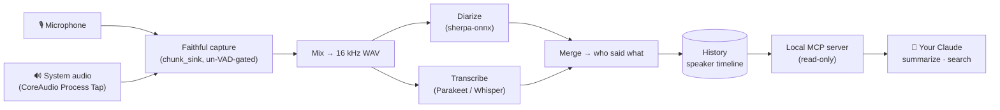

<div align="center">

# 👂 Plaudy

### The local-first meeting recorder that knows *who said what* — and never phones home.

Your Mac records the room, transcribes it, separates the speakers, and hands the result to **your own AI** — **100% on device**. No cloud. No account. No audio ever leaves your machine.


[Why](#why-plaudy) · [Features](#features) · [How it works](#how-it-works) · [Quick start](#quick-start) · [Plaudy vs alternatives](#plaudy-vs-the-alternatives) · [Privacy](#privacy-the-whole-point) · [Roadmap](#status--roadmap)

</div>

---

**Plaudy** is an open-source, on-device alternative to Plaud / Otter / Fireflies for **macOS**. One click — or fully hands-free — captures a meeting: your **microphone** *and* the Mac's **system audio** (the other side of the call), as two streams. It lands as a single, **speaker-attributed transcript** you can play back, search, and summarize with **your own Claude** over a local bridge. Built on the excellent [Handy](https://github.com/cjpais/Handy).

---

## Why Plaudy?

Meeting tools make you pick a poison: **convenient but in the cloud** (Plaud, Otter, Fireflies — your private conversations uploaded to someone else's servers), or **local but clunky** (a virtual audio driver to install, a backend server to babysit, and no real "who said what").

Plaudy refuses the trade-off:

- 🔒 **Actually private.** Capture, transcription (Parakeet/Whisper), and speaker diarization all run **on your Mac**. Nothing is uploaded — ever. No account, no telemetry, no sign-in.
- 🎙️ **Both sides, natively.** Records your mic **and** the Mac's system audio through the native **CoreAudio Process Tap** (macOS 14.4+). No BlackHole, no virtual devices, no kernel extensions to install.
- 🗣️ **Who said what.** Real on-device diarization (sherpa-onnx) turns a recording into a **per-speaker timeline** — `Me · 0:04 · "…"` / `Speaker 1 · 0:09 · "…"` — not an anonymous wall of text.
- 🤖 **Bring your own AI.** Instead of bundling a weak local model, Plaudy exposes your library to **your** AI (Claude / Claude Code) over a local **[MCP](https://modelcontextprotocol.io) server**. Summaries run through the AI *you* already use — the transcript text goes to your Claude (there's no Plaudy cloud in between), while your audio and database stay on the Mac. *(Prefer fully offline? Point the same MCP at a local model — the bridge is model-agnostic.)*
- 🪄 **Feels like a Mac app.** A menu-bar "graffetta" — the icon becomes an **ear** 👂 the moment it's listening (an honest, always-visible signal). One click to record, or opt-in **auto-capture** that starts on its own when audio plays.
- 🧩 **One native app.** No server process, no Docker, no Python backend. Open it and record.

---

## Features

| | |
| --- | --- |
| 🎧 **Dual-stream meeting capture** | Mic (`"Me"`) + system audio, mixed into one playable WAV, kept separate in the transcript. |
| 🗣️ **On-device speaker diarization** | pyannote-segmentation + TitaNet via sherpa-onnx — fully offline. |
| 🧠 **Local ASR** | Parakeet / Whisper (whisper-rs, Metal-accelerated). |
| 🫧 **Echo de-dup (`drop_bleed`)** | When audio plays over speakers and the mic re-hears it, one person isn't split into two. |
| 👂 **Menu-bar ear** | The tray icon turns into an ear while recording — you always know when it listens. |
| 🪄 **Opt-in auto-capture** *(experimental)* | Senses when another app is emitting audio (per-process CoreAudio attribution, *your own tap excluded*) and starts a session on its own. |
| 🗂️ **History as result, not dump** | Each recording is a **session card**: source icon, topic title, duration, speaker chips, and a collapsible speaker timeline + player. |
| 🔌 **Local MCP bridge** | A dependency-free, read-only MCP server lets Claude `list` / `get` / `search` your recordings — locally. |
| 📦 **Offline-ready** | Diarization models are bundled; a fresh clone works without downloading anything. |
| ♻️ **Crash-safe & self-healing** | Sessions stream to disk frame-by-frame; an interrupted recording is recovered on next launch. |

---

## How it works



The key design insight: **mic and system audio feed the *same* consumer** through a producer-agnostic `chunk_sink`, so there's no parallel pipeline — any future source just emits samples. Everything downstream (mix → diarize → transcribe → merge → speaker timeline) is shared. Deep dive: **[docs/CODEBASE.md](docs/CODEBASE.md)**.

---

## Quick start

**Apple Silicon Mac.** The verified setup builds **without Homebrew and without full Xcode** (Command Line Tools only).

```bash
git clone https://github.com/uppifyagency/plaudy.git && cd plaudy/handy

# Toolchain on PATH + two escape hatches (CLT-only build)
export PATH="$HOME/.local/bin:$HOME/.cargo/bin:$HOME/.bun/bin:$PATH"
export CMAKE_POLICY_VERSION_MINIMUM=3.5   # standalone CMake 4.x rejects pre-3.5 policy floors in native deps
export HANDY_FORCE_AI_STUB=1              # CLT lacks the @Generable macro plugin → Apple Intelligence stub

bun install
bun tauri dev                             # run it (hot-reload) …
bun tauri build                           # … or build Plaudy.app + Plaudy_*.dmg
```

- **First launch:** grant **Microphone** and **Audio Recording** permission (no Screen Recording needed — the Process Tap uses the audio-capture TCC permission, so there's no purple banner).
- **Record a meeting:** click the menu-bar **graffetta**, or run the app and hit the record hero. Watch the tray icon become an **ear** 👂. Stop, and the speaker-attributed transcript appears in **History**.
- **Summarize with Claude:** the local MCP server is registered in [`.mcp.json`](.mcp.json) — point Claude / Claude Code at this repo and ask it to summarize or search your sessions.
- **Tests:** `cd handy/src-tauri && cargo test --lib` → 102 passed · `cd handy/mcp && bun test` → 4 pass.

> The current `.dmg` is **ad-hoc signed** (build-from-source or right-click → Open on first launch). A Developer-ID-signed & notarized release is on the roadmap. Full build notes: [handy/BUILD.md](handy/BUILD.md).

---

## Plaudy vs the cloud tools

The category Plaudy replaces is the **cloud recorder** — Plaud, Otter, Fireflies — where convenience costs you privacy:

| | **👂 Plaudy** | Plaud · Otter · Fireflies *(cloud)* |
| --- | :---: | :---: |
| Runs fully **on-device** | ✅ | ❌ uploaded to their servers |
| **Account** required | ❌ none | ✅ |
| Your **audio** leaves the machine | ❌ never | ✅ always |
| **Who said what** (diarization) | ✅ on-device, per-segment timeline | ✅ (in their cloud) |
| **System-audio** capture | ✅ native CoreAudio Process Tap, no virtual driver | n/a |
| **AI** summaries | 🤖 *your* AI via local MCP — your account, your data | their cloud LLM, their servers |
| **Price** | free · open-source (MIT) | subscription |

### …and vs Meetily (the closest open-source peer)

Credit where due: **[Meetily](https://github.com/Zackriya-Solutions/meetily)** is an excellent, mature, MIT-licensed local meeting assistant — also Rust + Tauri, Parakeet/Whisper, 100% local. We won't pretend we're strictly "better"; we make **different bets**:

- **Where Meetily leads today:** real-time *live* transcription, **Windows & Linux** support, a larger community, and built-in summarization providers.
- **Where Plaudy is different:** **on-device speaker diarization in the free/open build** (Meetily's is a PRO / "coming soon" feature); an **[MCP](https://modelcontextprotocol.io) bridge** so any AI *agent* (Claude Code) can search & summarize your whole library programmatically — not just an in-app summary button; and a **push-to-talk dictation** heritage (built on [Handy](https://github.com/cjpais/Handy)) for quick notes, not only meetings.

Want live transcription on Windows? Meetily. Want a Mac-native, agent-connected recorder with open diarization? Plaudy.

<sub>Comparison based on each project's public docs as of July 2026. Wrong or out of date? Open a PR — we'd rather be accurate than flattering.</sub>

---

## Privacy — the whole point

- **Capture, transcription & diarization: zero network.** They run on-device (ONNX). The MCP server speaks **stdio only** — no listener, no socket, no fetch. Plaudy itself never phones home: no telemetry, no Plaudy account, no Plaudy server.
- **Your audio never leaves the Mac.** The recordings and the SQLite DB live in `~/Library/Application Support/` and stay there.
- **The AI step is yours, and opt-in.** When *you* ask your Claude to summarize over MCP, the **transcript text** goes to the AI you already use — under your own account, exactly like any other Claude use. There's no Plaudy middleman, and you can point the bridge at a local model to keep even that offline.
- **The MCP bridge is read-only.** It opens `history.db` `readonly`; every query is parameterized. It physically cannot alter or exfiltrate a recording.
- **Honest signals.** The menu-bar ear shows when Plaudy is listening; auto-capture is **opt-in** and never records your bare microphone on its own — the mic only joins a session that system audio has already triggered.

---

## Status & roadmap

**Early, but real** — core capture, diarization, and the MCP bridge are built and **validated live**.

- ✅ Dual-stream meeting capture · on-device diarization · echo de-dup · History session cards · menu-bar ear · local MCP bridge · bundled offline models · 102 Rust + 4 MCP tests green.
- 🧪 **Auto-capture** (per-process audio trigger) — works E2E, **opt-in / experimental** pending real-meeting hardening.
- 🔜 Developer-ID signing + **notarized `.dmg`** · in-app search & export · "Enable diarization" one-tap download · broader i18n.
- 🔭 iPhone capture (iPhone-as-mic + Mac-as-brain) — deferred (needs full Xcode).

Working on it or want to help? Start at **[docs/HANDOFF-GIANNI.md](docs/HANDOFF-GIANNI.md)** (dev onboarding) and **[docs/CODEBASE.md](docs/CODEBASE.md)** (technical reference).

---

## Built on Handy · Credits · License

Plaudy stands on the shoulders of **[Handy](https://github.com/cjpais/Handy)** by CJ Pais & contributors (MIT) — a superb Tauri push-to-talk dictation app we extend in place to add long-form recording, system-audio capture, diarization, the MCP bridge, and the meeting UX. Upstream architecture docs are mirrored under [`docs/handy-architecture/`](docs/handy-architecture/).

- Diarization: **[sherpa-onnx](https://github.com/k2-fsa/sherpa-onnx)** (k2-fsa) with pyannote-segmentation-3.0 + NeMo TitaNet-small.
- ASR: whisper-rs / Parakeet · Audio: cpal + CoreAudio · UI: React + Tauri 2.

Licensed **MIT** (inherited from Handy). See [handy/LICENSE](handy/LICENSE).

<div align="center"><sub>Made for people who want their meetings remembered — not harvested.</sub></div>
