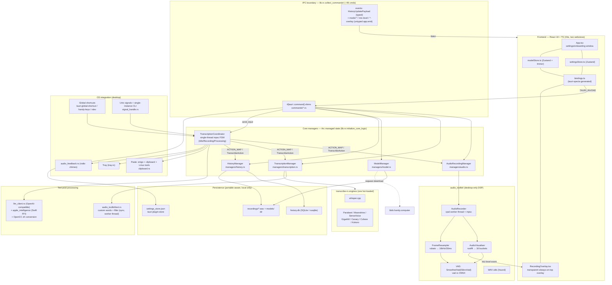

# Handy — Architecture Overview

> **Plaude Local note (2026-06-19):** this maps **Handy as-is**. The fork has since added two subsystems — long-form **sessions** (`managers/session.rs`) and **system-audio capture** (`audio_toolkit/audio/system_audio.rs`), both feeding the same producer-agnostic `run_consumer`/`chunk_sink` seam described in §3–4. Current built state and the roadmap forward: [`../HANDOFF-FASE2.md`](../HANDOFF-FASE2.md).

> Authoritative, single-source architecture map for the Handy speech-to-text app.
> Synthesizes the 12 per-subsystem forensic docs in this directory (`01`–`12`). Read those for citation-level detail; this doc is the orientation layer.
> All paths are relative to `handy/src-tauri/` (Rust backend) or `handy/src/` (frontend) unless noted.

---

## 1. Executive summary

Handy is a cross-platform **desktop** push-to-talk dictation app built on **Tauri 2.x** (Rust backend, React 18 + TypeScript frontend bundled by Vite). A global keyboard shortcut (or Unix signal, or single-instance CLI flag) triggers a single-source microphone capture through a `cpal`-based audio toolkit that downmixes to mono, runs an FFT level visualizer, resamples to fixed 16 kHz / 30 ms frames via `rubato`, and gates speech through a Silero ONNX VAD; on key-release the accumulated mono buffer is handed to a single hot-loaded local inference engine (whisper.cpp or one of seven ONNX models via `transcribe-rs`), cleaned by a deterministic custom-words/filler stage, optionally rewritten by an LLM or Apple Intelligence post-processor, then **pasted into the focused app** and persisted as one flat-string row in SQLite plus a sibling 16 kHz WAV. Four long-lived `Arc<Manager>` singletons (Audio, Model, Transcription, History) plus a single-threaded `TranscriptionCoordinator` state machine own all state; the frontend is a thin, fully-typed IPC client (`tauri-specta`-generated `bindings.ts`) over ~95 commands and a mostly-untyped event stream. The design is **batch-oriented, single-mic, single-speaker, single-model, local-only, and desktop-only** — there is **no long-form session model, no diarization, no system/call audio, no cloud sync, and no iOS/mobile build** today (only a dangling `mobile_entry_point` macro and icon scaffolding).

---

## 2. High-level component diagram

---

## 3. End-to-end runtime data flow: one transcription

A single push-to-talk dictation, from key-press to history row. Citations point at the real functions/files.

| # | Stage | What happens | Key location |
|---|-------|--------------|--------------|
| 1 | **Trigger** | OS key event arrives via the Tauri global-shortcut plugin closure (`shortcut/tauri_impl.rs:107`) or the `handy-keys` manager thread (`shortcut/handy_keys.rs:128`). Unix `SIGUSR1/2` (`signal_handle.rs:25`) and single-instance CLI argv (`lib.rs:483-493`) are alternate entry points. | `shortcut/handler.rs:29` `handle_shortcut_event` |
| 2 | **Funnel** | All triggers converge on `send_transcription_input` → `TranscriptionCoordinator::send_input`, pushing onto an mpsc channel into the single coordinator thread (30 ms debounce, `Idle/Recording/Processing` FSM, PTT vs toggle). | `signal_handle.rs:16`, `transcription_coordinator.rs:121` |
| 3 | **Start action** | Coordinator `start()` dispatches `ACTION_MAP["transcribe"]` → `TranscribeAction::start`: `preload_vad()`, `try_start_recording(binding_id)`, `apply_mute()`, plays the Start chime (`audio_feedback.rs`). | `actions.rs:389`, `managers/audio.rs:402` |
| 4 | **Capture** | `AudioRecorder::open` spawns a worker thread owning the `cpal` input stream at the device's **native** sample rate; the realtime callback downmixes interleaved channels → mono and sends `AudioChunk::Samples` over mpsc to `run_consumer`. | `audio_toolkit/audio/recorder.rs:65`, `:250-263`, `:395` |
| 5 | **Visualize** | `run_consumer` fans raw audio to `AudioVisualiser` (rustfft → 16 perceptual buckets) → `level_cb` → `overlay::emit_levels` emits the `mic-level` event to the overlay window. | `recorder.rs`, `overlay.rs:388-396`, consumed `src/overlay/RecordingOverlay.tsx:41` |
| 6 | **Resample** | `FrameResampler` (rubato `FftFixedIn`) converts to exact **16 kHz / 480-sample (30 ms)** mono frames. | `audio_toolkit/audio/resampler.rs:37` |
| 7 | **VAD gate** | Each frame goes through `SmoothedVad(SileroVad)::push_frame` (`vad-rs` ONNX, `prob > 0.3`, onset/hangover/pre-roll smoothing). `Speech` frames append to `processed_samples`; `Noise` dropped (lossy). | `vad/smoothed.rs:41`, `vad/silero.rs:46`, `recorder.rs:433-447` |
| 8 | **Stop** | Key-release → coordinator `stop()` → `TranscribeAction::stop` → `AudioRecordingManager::stop_recording`. `Cmd::Stop` drains until the `EndOfStream` sentinel (zero sample loss), replies with the whole mono 16 kHz `Vec<f32>`; clips < 1 s are padded. | `actions.rs:492-516`, `managers/audio.rs:427-477`, `recorder.rs:205` |
| 9 | **Persist audio (parallel)** | `spawn_blocking(save_wav_file)` writes `recordings/handy-<unix_ts>.wav` concurrently with transcription; `verify_wav_file` validates. | `actions.rs:542`, `audio_toolkit/audio/utils.rs:31-50` |
| 10 | **Transcribe** | `tm.transcribe(samples)` (BLOCKING) waits on the load condvar, validates language vs `ModelInfo.supported_languages`, `take()`s the engine out of the mutex, runs inference under `catch_unwind`, per-engine param mapping, re-inserts on success. Returns `result.text` only (timestamps/segments discarded). | `managers/transcription.rs:440-733`, `:701` |
| 11 | **Deterministic cleanup** | Inside `transcribe`: `apply_custom_words` (Levenshtein + Soundex fuzzy match, skipped for Whisper which uses `initial_prompt`) then `filter_transcription_output` (filler removal, stutter collapse, keyed on `app_language`). | `transcription.rs:694`, `:704`, `audio_toolkit/text.rs` |
| 12 | **Post-process (async)** | Back in the spawned Tokio task: `process_transcription_output` runs OpenCC zh-Hans/zh-Hant conversion, then — if the post-process flag is set — `post_process_transcription` dispatches to `llm_client.rs` (OpenAI-compatible HTTP, structured JSON `{transcription}`) or `apple_intelligence.rs` (Swift FFI, macOS-aarch64). Any failure returns `None` → keep pre-LLM text. | `actions.rs:349`, `:66`, `llm_client.rs`, `apple_intelligence.rs:33` |
| 13 | **Persist row** | `HistoryManager::save_entry` stamps `Utc::now`, formats a local-time title, INSERTs the row (raw + post-processed text + prompt), runs `cleanup_old_entries`, emits the typed `HistoryUpdatePayload::Added`. | `actions.rs:591`, `managers/history.rs:219` |
| 14 | **Output** | `utils::paste` on the **main thread** branches across six `PasteMethod`s (enigo keystrokes / Linux `wtype`/`ydotool`/`xdotool` / external script), saves+restores the clipboard, optionally auto-submits Enter. Stop chime plays. | `actions.rs:609`, `shortcut/clipboard.rs` |
| 15 | **UI update** | Frontend `HistorySettings.tsx` (subscribed to `events.historyUpdatePayload`) patches state live without refetch. | `src/components/settings/HistorySettings.tsx:135` |

**Retry path** (`commands/history.rs:64` `retry_history_entry_transcription`): reloads the stored WAV via `read_wav_samples`, re-runs steps 10–13 under `spawn_blocking`, UPDATEs the row (no new file).

---

## 4. Manager & threading model

### Managed state (the four singletons + coordinator)

Constructed once in `lib.rs::initialize_core_logic` (`lib.rs:147-166`) and `.manage()`d as `Arc<…>` in Tauri state, auto-injected into commands as `State<Arc<…>>` (invisible to TS):

- **`AudioRecordingManager`** (`managers/audio.rs:146`) — stateful orchestration between the shortcut/command surface and the `cpal` engine. Owns a lazily-built `AudioRecorder`, a `RecordingState` FSM (`Idle` / `Recording{binding_id}`), a `MicrophoneMode` (`AlwaysOn`/`OnDemand`), `Arc<Mutex>` flags, and an `AtomicU64` `close_generation` epoch token coordinating a 30 s lazy stream-close timer. Does **not** touch CoreAudio/WASAPI/ALSA directly.
- **`TranscriptionManager`** (`managers/transcription.rs`) — owns exactly one hot-loaded engine behind `Arc<Mutex<Option<LoadedEngine>>>` (a one-of-eight sum type). Provides load/unload/transcribe, a background idle-watcher thread that auto-unloads after `ModelUnloadTimeout`, accelerator/GPU plumbing, and `catch_unwind` panic isolation so a crashing native engine unloads cleanly.
- **`ModelManager`** (`managers/model.rs`) — owns the on-disk model lifecycle: hard-coded ~16-model catalog + auto-discovered custom `.bin`s, resumable/cancellable `reqwest` download with throttled progress events, SHA-256 verify (`spawn_blocking`), atomic `tar.gz` extraction, deletion, path resolution. Delegates in-memory load/unload to `TranscriptionManager`.
- **`HistoryManager`** (`managers/history.rs`) — SQLite persistence via `rusqlite_migration` (4 additive migrations + legacy bridge), CRUD/cleanup/title formatting, typed `HistoryUpdatePayload` events. **No connection pool**: a fresh `rusqlite::Connection` is opened per call; several methods are async-in-name-only.
- **`TranscriptionCoordinator`** (`transcription_coordinator.rs`) — **the serialization choke point.** A single worker thread fed by an mpsc channel runs the `Idle/Recording/Processing` state machine with a 30 ms debounce, eliminating all record-to-paste races. Every trigger (keyboard, signal, CLI) funnels through `send_input`.

### Threading model

| Thread | Owner | Role |
|--------|-------|------|
| **Tauri main / UI thread** | Tauri runtime | Event loop, tray, window events; `utils::paste` runs here (`actions.rs:609`). |
| **Coordinator thread** | `TranscriptionCoordinator` | Single serialized consumer of all capture triggers; drives `TranscribeAction`. |
| **Capture worker thread** | `AudioRecorder::open` | Owns the `cpal` `Stream` + `run_consumer` loop (visualize → resample → VAD → accumulate); controlled via `Cmd::{Start,Stop(reply),Shutdown}`. |
| **cpal realtime callback thread** | OS audio | Downmixes interleaved → mono, sends `AudioChunk` over mpsc. Never blocks. |
| **Idle-watcher thread** | `TranscriptionManager` | Polls `is_recording()` keep-alive; auto-unloads the model after timeout. |
| **Tokio tasks** | `TranscribeAction::stop` | Async post-stop pipeline: WAV save (`spawn_blocking`), blocking `transcribe`, LLM post-process, history save. |
| **Detached lazy-close timers** | `AudioRecordingManager` | 30 s stream idle close, cancelled via the `close_generation` epoch token. |
| **Background pre-warm** | `lib.rs:552-554` | Pre-computes GPU device list. |

**Concurrency invariants:** one capture worker + one cpal callback thread per recording; `RecordingState` is a single global FSM (no concurrent sessions); the coordinator serializes the lifecycle; `close_generation` (`AtomicU64`) cancels stale lazy-closes; engine residency is single-model (`Arc<Mutex<Option<LoadedEngine>>>`). Known footguns: plain `.lock().unwrap()` with no poison recovery throughout; resampler `expect`/`assert` can crash the worker; VAD fails open (`unwrap_or(Speech)`) with no telemetry.

---

## 5. External dependency map

Grouped by concern. Versions from `src-tauri/Cargo.toml` (Rust, v0.8.3) and `package.json` (npm).

### Rust crates — capture & DSP
- `cpal 0.16` — cross-platform audio I/O (input streams, device enumeration).
- `rubato 0.16` — `FftFixedIn` resampler to 16 kHz / 30 ms frames.
- `rustfft 6.4` — FFT for the mic-level spectrum visualizer.
- `vad-rs` (git `cjpais/vad-rs`, default-features off) — Silero VAD v4 ONNX wrapper.
- `hound 3.5` — WAV read/verify/write (mono 16 kHz 16-bit PCM).

### Rust crates — transcription & models
- `transcribe-rs 0.3.x` — the engine layer: whisper.cpp + 7 ONNX back-ends. **GPU features are re-specified per target** (see §6).
- `sha2 0.10` — model download SHA-256 verification.
- `tar 0.4` + `flate2 1.0` — atomic `.tar.gz` extraction for directory-based ONNX engines.
- `reqwest 0.12` (`json`, `stream`) — model downloads (resumable, Range header) and OpenAI-compatible LLM calls.
- `futures-util 0.3`, `tokio 1.43` — async runtime + stream utilities.

### Rust crates — text post-processing
- `strsim 0.11` — Levenshtein distance for fuzzy custom-word correction.
- `natural 0.5` — Soundex phonetic matching.
- `regex 1` — filler removal / stutter collapse.
- `ferrous-opencc 0.2` — Simplified ⇄ Traditional Chinese conversion (local, offline).
- (macOS-aarch64) Swift `FoundationModels` bridge compiled by `build.rs` for on-device Apple Intelligence.

### Rust crates — persistence & config
- `rusqlite 0.37` (`bundled`) + `rusqlite_migration 2.3` — history DB.
- `serde 1` / `serde_json 1` — settings + IPC serialization.
- `chrono 0.4` — timestamps / title formatting.
- `once_cell 1` — lazy statics (ACTION_MAP, log-level atomics).

### Rust crates — input / OS integration / lifecycle
- `rdev` (git `rustdesk-org/rdev`) — low-level global key capture.
- `handy-keys 0.2.4` — alternate custom shortcut backend (manager thread + mpsc).
- `enigo 0.6` — synthetic keystroke injection for paste.
- `rodio` (git `cjpais/rodio`) — audio-feedback chime playback.
- `signal-hook 0.3` (unix) — SIGUSR1/2 capture triggers.
- `clap 4` (derive) — CLI argument parsing.
- `anyhow 1`, `log 0.4`, `env_filter 0.1` — errors + dual-target logging.
- (windows) `windows 0.61` (`Win32_Media_Audio_Endpoints` etc.), `winreg 0.55`.
- (linux) `gtk 0.18` + `gtk-layer-shell 0.8` — overlay layer-shell.
- (macOS) `tauri-nspanel` (git) — overlay NSPanel.

### Tauri runtime & plugins
- **Core:** `tauri 2.10.2` (`protocol-asset`, `macos-private-api`, `tray-icon`, `image-png`).
- **Forked runtime (supply-chain pin):** `tauri-runtime`, `tauri-runtime-wry`, `tauri-utils` all patched to `cjpais/tauri` branch `handy-2.10.2`.
- **Bindings:** `specta =2.0.0-rc.22`, `specta-typescript 0.0.9`, `tauri-specta =2.0.0-rc.21` — generate `bindings.ts` (debug builds only).
- **Plugins (~15):** `tauri-plugin-store` (settings), `-log`, `-opener`, `-os`, `-clipboard-manager`, `-macos-permissions`, `-process`, `-fs`, `-dialog`; desktop-only: `-autostart`, `-global-shortcut`, `-single-instance` (CLI remote control), `-updater`.

### npm / frontend
- **Framework:** `react 18.3` + `react-dom`, `vite 6`, `typescript 5.6`, `@tailwindcss/vite 4` / `tailwindcss 4`.
- **State:** `zustand 5` (+ `subscribeWithSelector`), `immer 11` (model store).
- **IPC:** `@tauri-apps/api 2.10` + the matching `@tauri-apps/plugin-*` JS bindings (autostart, clipboard-manager, dialog, fs, global-shortcut, opener, os, process, sql, store, updater), `tauri-plugin-macos-permissions-api`.
- **i18n:** `i18next 25` + `react-i18next 16` (20 locales, RTL-aware).
- **UI:** `lucide-react` (icons), `react-select`, `sonner` (toasts), `zod` (validation).
- **Dev/test:** `@playwright/test`, `@tauri-apps/cli`, ESLint (`eslint-plugin-i18next` enforces no hardcoded JSX strings), Prettier.

---

## 6. Platform matrix

GPU backend is selected **at compile time** via per-target `Cargo.toml` cfg blocks that re-specify `transcribe-rs` features; runtime preference is applied through `apply_accelerator_settings` (`transcription.rs:738-769`) into `transcribe-rs` global atomics read at model load.

| Concern | macOS | Windows | Linux |
|---------|-------|---------|-------|
| **Whisper GPU backend** | Metal (`whisper-metal`, `Cargo.toml:103`) | Vulkan (`whisper-vulkan`, `:91`) | Vulkan (`whisper-vulkan`, `:108`) |
| **ONNX (Parakeet/Canary/…) execution provider** | **CPU fallback** (no CoreML wired — gap) | DirectML (`ort-directml`, `:91`) | CPU |
| **Overlay implementation** | NSPanel (`tauri-nspanel`, `overlay.rs`) | Win32 topmost | GTK layer-shell (`gtk-layer-shell`; disable via `HANDY_NO_GTK_LAYER_SHELL=1`) |
| **Global shortcuts** | tauri-global-shortcut / handy-keys / rdev | same | same (limited Wayland) |
| **Paste backend** | enigo + clipboard | enigo + clipboard | enigo + native tools (`wtype`/`kwtype`/`dotool`/`ydotool`/`xdotool`/`wl-copy`) |
| **Permissions** | Accessibility (shortcuts) + microphone entitlement | code signing | — |
| **Capture triggers** | shortcut + single-instance CLI | shortcut + single-instance CLI | shortcut + CLI + Unix SIGUSR1/2 (`signal_handle.rs`) |
| **On-device summary LLM** | Apple Intelligence via Swift FoundationModels FFI (aarch64 only) | — (cloud LLM only) | — (cloud LLM only) |
| **Packaging** | dmg/app (ad-hoc signed `signingIdentity:"-"`, no notarization) | NSIS exe (forked portable template) | deb/rpm/AppImage + Linux-only Nix flake |
| **Updater** | minisign-signed GitHub auto-updater (`github.com/cjpais/Handy`) | same | same |
| **Model host** | `blob.handy.computer` (single private blob host) | same | same |

### ⚠️ No iOS / mobile target today

There is **no buildable iOS or Android app**. What exists is scaffolding only:

- `run` carries `#[cfg_attr(mobile, tauri::mobile_entry_point)]` (`lib.rs:316`) and the crate is built as `staticlib`/`cdylib` (`Cargo.toml:20`), but nothing is wired.
- iOS icons + `gen/apple/PrivacyInfo.xcprivacy` exist; there is **no** Xcode project, **no** mobile Tauri config, **no** `cfg(target_os="ios")` deps block, and **no** mobile audio/permissions path.
- The entire OS-integration surface (tray, overlay, Unix signals, enigo paste, `cpal`/ALSA capture, Linux CLI shellouts, clamshell detection) is desktop-only.
- The Nix flake is **Linux-only** (`flake.nix:24-27`).
- A real mobile target would require `tauri ios init`, an `AVAudioEngine`/CoreAudio capture bridge (cpal iOS support is limited), a CoreML/Metal iOS build of `transcribe-rs`, background-audio entitlements, and a network RPC transport to replace `TAURI_INVOKE`. The platform-neutral seam for that work is `TranscriptionCoordinator::send_input` / `signal_handle::send_transcription_input`, with the `transcribe-rs` engine layer and the portable VAD/resampler DSP reusable on-device.

---

## 7. Subsystem document index

| # | Doc | One-line description |
|---|-----|----------------------|
| 00 | (this file) `00-ARCHITECTURE-OVERVIEW.md` | Authoritative cross-subsystem overview, data flow, threading, deps, platform matrix. |
| 01 | [01-app-lifecycle-and-tauri-setup.md](./01-app-lifecycle-and-tauri-setup.md) | Bootstrap & process lifecycle: `main.rs`/`lib.rs::run`, CLI, ~90 commands, ~15 plugins, single-instance, tray, overlay, settings blob, the capture-trigger choke point. |
| 02 | [02-audio-toolkit-capture-pipeline.md](./02-audio-toolkit-capture-pipeline.md) | Low-level `cpal` capture: device enumeration, mono downmix, FFT visualizer, rubato resampler to 16 kHz/30 ms, WAV utils, EndOfStream drain protocol. |
| 03 | [03-voice-activity-detection.md](./03-voice-activity-detection.md) | Trait-based VAD: Silero v4 ONNX (`silero.rs`) + `SmoothedVad` onset/hangover/pre-roll decorator; per-frame speech/noise gating, no timestamps/speakers. |
| 04 | [04-managers-audio-recording.md](./04-managers-audio-recording.md) | `AudioRecordingManager`: `RecordingState` FSM, mic mode, mute, clamshell swap, lazy stream-close epoch token; orchestrates the toolkit, returns one mono buffer. |
| 05 | [05-transcription-engines-and-coordinator.md](./05-transcription-engines-and-coordinator.md) | `TranscriptionManager` (single hot engine, idle-unload, `catch_unwind`) + `TranscriptionCoordinator` (mpsc Idle/Recording/Processing FSM); the 8 `transcribe-rs` engines. |
| 06 | [06-model-management.md](./06-model-management.md) | `ModelManager`: hard-coded catalog, resumable download, SHA-256 verify, tar.gz extract, path resolution; `model-*` events; no diarizer/summarizer/iOS path. |
| 07 | [07-text-postprocessing-and-llm.md](./07-text-postprocessing-and-llm.md) | Deterministic cleanup (custom words, filler, stutter) + async LLM/Apple-Intelligence rewrite + OpenCC zh conversion; structured-output schema, silent fallback. |
| 08 | [08-ipc-commands-and-bindings.md](./08-ipc-commands-and-bindings.md) | The ~95-command IPC boundary + generated `bindings.ts`; typed `HistoryUpdatePayload` vs untyped `app.emit` events; `Result<T,String>` errors; known bugs. |
| 09 | [09-history-persistence-sqlite.md](./09-history-persistence-sqlite.md) | `HistoryManager` + SQLite schema (4 migrations), per-recording WAV, retention policy, flat single-string transcript model; no segments/speakers/sync. |
| 10 | [10-input-shortcuts-clipboard-feedback.md](./10-input-shortcuts-clipboard-feedback.md) | Shortcut backends (tauri/handy-keys/rdev), shared handler, six `PasteMethod`s + clipboard save/restore + Linux tools, audio chimes, clamshell lid detection. |
| 11 | [11-frontend-react.md](./11-frontend-react.md) | React/TS SPA: two webviews, Zustand `settingsStore`/`modelStore`, optimistic-update dispatch tables, i18next (20 locales), onboarding FSM, overlay. |
| 12 | [12-build-packaging-platform.md](./12-build-packaging-platform.md) | Tauri build, compile-time GPU backend selection, `build.rs` codegen (tray i18n + Swift bridge), bundle formats, minisign updater, Nix flake, forked-Tauri pin. |
